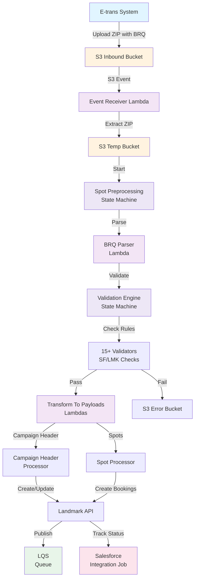
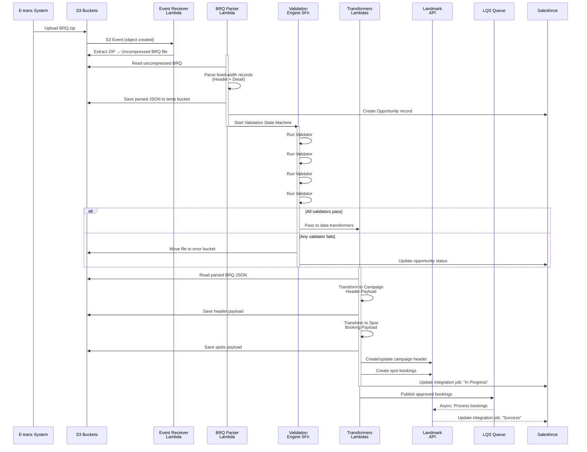
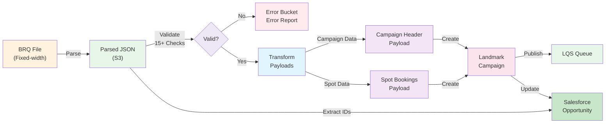
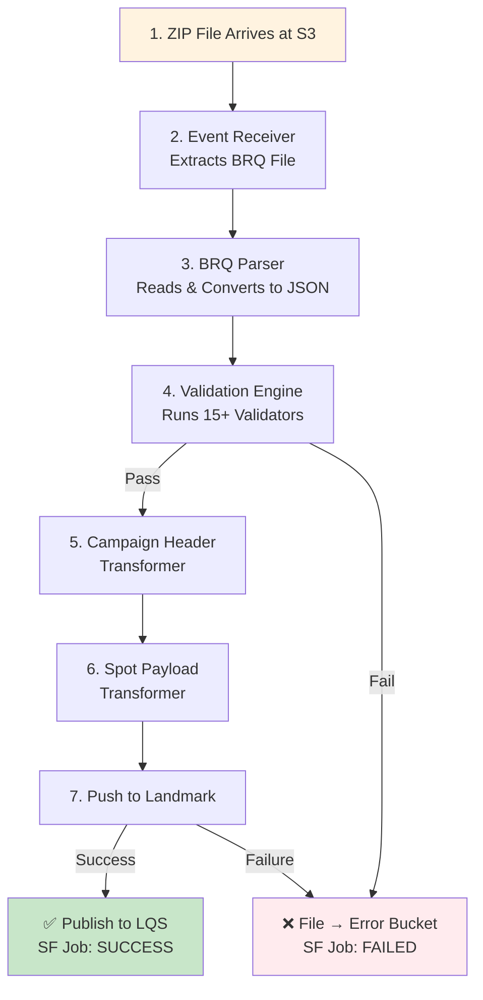
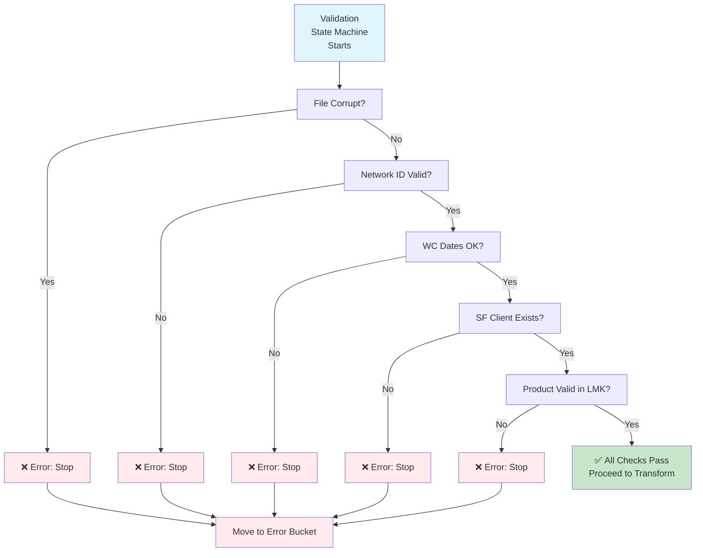

# A1 Ebooking Integration System

**One-line summary:** A serverless AWS integration service that processes media booking requests (BRQ files) from E-trans, validates them against Salesforce and Landmark systems, and creates/updates booking opportunities in Landmark.

---

## Table of Contents

1. [Overview](#overview)
2. [Architecture at a Glance](#architecture-at-a-glance)
3. [Repository Structure](#repository-structure)
4. [How It Works - Deep Dive](#how-it-works---deep-dive)
5. [Workflow Diagrams](#workflow-diagrams)
6. [Installation & Setup](#installation--setup)
7. [Usage Examples](#usage-examples)
8. [Testing & Quality](#testing--quality)
9. [Troubleshooting](#troubleshooting)
10. [Extending the Project](#extending-the-project)
11. [Security & Secrets Management](#security--secrets-management)
12. [Contributing Guidelines](#contributing-guidelines)
13. [Appendix](#appendix)

---

## Overview

### What This Project Does

The A1 Ebooking Integration System is a **serverless event-driven pipeline** that:

1. **Receives** zipped BRQ (Booking Request) files from external E-trans systems via S3
2. **Extracts & Parses** fixed-width format BRQ files into structured data
3. **Validates** booking data against multiple dimensions:
   - File integrity and format
   - Salesforce account hierarchies (Agency/Direct clients)
   - Landmark product existence and date ranges
   - BRQ duplication and business rules
4. **Transforms** validated data into Landmark API payloads for:
   - Campaign header creation/updates
   - Spot booking management
5. **Publishes** bookings to Landmark via the LQS (Landmark Queueing Service)
6. **Tracks** integration status in Salesforce as Integration Jobs

### Who It's For

- **Media Networks**: Broadcasting organizations receiving media booking requests
- **Mediation Systems**: E-trans system operators processing booking files
- **Sales Operations**: Teams managing media campaigns in Salesforce/Landmark

### Key Features

- ✅ **Fixed-width BRQ file parsing** with configurable column mappings
- ✅ **Multi-stage validation engine** with 15+ validators
- ✅ **Salesforce integration** for opportunity tracking
- ✅ **Landmark system integration** for booking management
- ✅ **AWS Step Functions orchestration** for reliable, auditable workflows
- ✅ **Comprehensive error handling** with detailed logging
- ✅ **S3-based file staging** for large payload handling
- ✅ **SSM Parameter Store** for environment-specific configuration
- ✅ **Serverless architecture** (Lambda + Step Functions)

---

## Architecture at a Glance

### Component Overview

| Component | Purpose | Location |
|-----------|---------|----------|
| **Event Receiver** | Listens to S3 events for incoming BRQ files | [ebooking_event_receiver/](R2_int_a1_ebookings/functions/ebooking_event_receiver/) |
| **BRQ Parser** | Extracts & parses fixed-width BRQ file format | [brq_file_parser/](R2_int_a1_ebookings/functions/brq_file_parser/) |
| **Validation Engine** | Executes 15+ validators for business rule compliance | [validation_engine/](R2_int_a1_ebookings/functions/validation_engine/) |
| **Payload Preparers** | Transforms BRQ data into Landmark API payloads | [a1_2/prepare_*](R2_int_a1_ebookings/functions/a1_2/) |
| **Integration Job Tracker** | Updates Salesforce with processing status | [a1_2/task_integration_job_*](R2_int_a1_ebookings/functions/a1_2/) |
| **LQS Publisher** | Publishes approved bookings to Landmark | [a1_2/push_to_lqs.py](R2_int_a1_ebookings/functions/a1_2/push_to_lqs.py) |
| **State Machines** | Orchestrates Lambda functions in sequence | [statemachine/](R2_int_a1_ebookings/statemachine/) |

### High-Level System Architecture



---

## Repository Structure

```
R2_int_a1_ebookings/
│
├── README.md                                    # Original quick-reference README
├── DETAILED_README.md                           # This comprehensive guide
├── pyproject.toml                               # Poetry dependency manifest
├── poetry.lock                                  # Locked dependency versions
├── pytest.ini                                   # Pytest configuration with env vars
├── samconfig.toml                               # SAM CLI deployment config
├── bandit.yaml                                  # Security scanning rules
├── GitVersion.yml                               # Versioning config
│
├── functions/                                   # All Lambda function handlers
│   ├── __init__.py
│   ├── BRQParser.py                             # Core: Fixed-width BRQ file parsing
│   ├── common_utils.py                          # Shared utilities (S3, logging, file ops)
│   ├── s3_utils.py                              # S3 read/write helpers
│   ├── simple_table.py                          # Data aggregation functions
│   ├── email_msg_config.json                    # Email notification templates
│   │
│   ├── ebooking_event_receiver/                 # Lambda: S3 event handler
│   │   ├── __init__.py
│   │   ├── a1_eBooking_file_event_receiver_function.py  # Entry: ZIP extraction
│   │   └── requirements.txt
│   │
│   ├── brq_file_parser/                         # Lambda: BRQ file processing
│   │   ├── a1_eBooking_brq_file_parser_function.py      # Entry: Parse & orchestrate
│   │   ├── parse_brq_file.py                    # BRQ parsing logic
│   │   ├── resolve_brq_file_name.py             # File naming resolution
│   │   ├── validate_brq_data.py                 # BRQ validation entry point
│   │   └── create_sf_opp.py                     # Salesforce opportunity creation
│   │
│   ├── a1_2/                                    # Lambda: Payload transformation & booking
│   │   ├── __init__.py
│   │   ├── get_brq_file.py                      # Entry: Retrieve parsed BRQ from S3
│   │   ├── prepare_campaign_header_payload.py   # Transform → Campaign header payload
│   │   ├── prepare_spot_payload.py              # Transform → Spot booking payload
│   │   ├── SalesAreaMap.py                      # Sales area mapping utility
│   │   ├── push_to_lqs.py                       # Publish to Landmark LQS
│   │   ├── call_spot_prebooking.py              # Call Landmark prebooking API
│   │   ├── task_integration_job_*.py            # Track status in Salesforce (4 files)
│   │   ├── check_s3_files.py                    # Verify file availability
│   │   ├── create_update_integration_job.py     # Salesforce job creation/update
│   │   ├── create_task_update_opportunity.py    # Update Salesforce task/opp
│   │   ├── report_failed.py                     # Report failures
│   │   ├── update_campaign_header.py            # Handle campaign header updates
│   │   ├── upload_report_to_task_opportunity.py # Upload reports to SF
│   │   └── generate_result_report.py            # Generate processing reports
│   │
│   └── validation_engine/                       # Lambdas: 15+ validation functions
│       ├── __init__.py
│       ├── validate_file_format.py              # File structure & corruption check
│       ├── validate_network_id.py               # Network (broadcaster) validation
│       ├── validate_brq_wcdates.py              # Week commencing date validation
│       ├── validate_demo_tolerance.py           # Demographic tolerance check
│       ├── validate_brq_request_id.py           # Duplicate BRQ ID detection
│       ├── validate_sf_agency_client.py         # SF Agency client account check
│       ├── validate_sf_direct_client.py         # SF Direct client account check
│       ├── validate_sf_agency_ad_client.py      # SF B2B relationship check
│       ├── validate_sf_b2b_client.py            # Additional B2B validation
│       ├── validate_product_advertiser.py       # Product-advertiser match
│       ├── validate_product_agency_client.py    # Product-agency client link
│       ├── validate_product_direct_client.py    # Product-direct client link
│       ├── validate_product_date_range.py       # Product active date range
│       ├── validate_brq_split.py                # BRQ data split validation
│       └── [others]                             # Additional validators
│
├── statemachine/                                # AWS Step Functions workflow definitions
│   ├── a1_ebooking_header_processing.asl.json   # Orchestrate campaign header creation
│   ├── a1_ebooking_validation_engine.asl.json   # Chain 15+ validators
│   ├── ebooking_spot_preprocessing.asl.json     # Parse → Transform→ Publish flow
│   └── ebooking_spot_processing.asl.json        # Spot booking orchestration
│
├── local_playground/                            # Local testing & debugging
│   ├── invoke_run.py                            # Local Lambda invocation script
│   ├── requests_run.py                          # HTTP client for local testing
│   └── send_msg_to_seil.sh                      # Step Functions execution script
│
├── pipelines/                                   # CI/CD orchestration
│   └── r2_int_a1_pipeline.yaml                  # Azure Pipelines CI/CD config
│
├── tests/                                       # Unit & integration tests
│   ├── __init__.py
│   ├── mock_boto.py                             # Moto-based AWS mocking setup
│   ├── test_brq_parser.py                       # BRQ parser tests
│   ├── test_resolve_brq_file_name.py            # File naming tests
│   ├── a1_2/                                    # Tests for a1_2 functions
│   ├── brq_file_parser/                         # Tests for parser
│   ├── brq_test_files/                          # Sample BRQ files for testing
│   ├── validation_engine/                       # Tests for validators
│   └── [BRQ_error.txt, ...]                     # Test fixtures
│
└── r2_int_a1_template.yaml                      # SAM CloudFormation template
                                                 # Defines all Lambdas, roles, policies

```

---

## How It Works - Deep Dive

### End-to-End Request Flow

This diagram shows how a BRQ file flows through the entire system:



### Core Module Interactions

#### 1. **Event Receiver** (`ebooking_event_receiver/`)

**File:** [a1_eBooking_file_event_receiver_function.py](R2_int_a1_ebookings/functions/ebooking_event_receiver/a1_eBooking_file_event_receiver_function.py)

**Trigger:** S3 ObjectCreated event on inbound bucket

**Responsibility:**
- Extract ZIP file contents
- Save uncompressed BRQ files to temp S3 bucket
- Log file extraction for audit trail

**Key Function:**
```python
def extract_brq_file(filekey, source_bucket_name, temp_bucket, event_id, context):
    # Opens ZIP from S3
    # Iterates through files in archive
    # Uploads each file individually to temp bucket
```

---

#### 2. **BRQ Parser** (`brq_file_parser/`)

**Files:**
- [a1_eBooking_brq_file_parser_function.py](R2_int_a1_ebookings/functions/brq_file_parser/a1_eBooking_brq_file_parser_function.py) - Main orchestrator
- [parse_brq_file.py](R2_int_a1_ebookings/functions/brq_file_parser/parse_brq_file.py) - Parse logic
- [BRQParser.py](R2_int_a1_ebookings/functions/BRQParser.py) - Core parser class

**Input:** Uncompressed BRQ file from S3

**Transformation:**

BRQ files use **fixed-width format** with hardcoded column positions. The parser slices strings based on these positions:

```
Example BRQ Header (first line):
20240115093500061ABC        7west Media                 1001234ABC Media Inc.      ...
^        ^      ^   ^        ^                          ^                          ^
8        12     18  58       64                         104                        208 (positions)

Mapped to:
{
  "GenerationDate": "20240115",
  "GenerationTime": "0935",
  "NetworkId": "061",
  "NetworkName": "7west Media",
  "AgencyId": "100123",
  "AgencyName": "4ABC Media Inc.",
  ...
}
```

**Key Class:** [BRQParser](R2_int_a1_ebookings/functions/BRQParser.py)

```python
class BRQParser:
    brq_header_slice_config = {
        "GenerationDate": [0, 8],          # String slice [0:8]
        "BookingTotalGrossValue": [110, 120, lambda: convert_money()],  # Apply function
        "ProposedDetailRecordCounter": [120, 126, int],  # Type cast to int
        # ... 15+ header fields
    }
    
    brq_detail_records_slice_config = {
        "ClientId": [0, 6],
        "ClientName": [6, 46],
        "WCDate": [258, 266],
        "ProposedSize": [296, 304, int],
        # ... 40+ detail fields
    }
    
    def parse(self, file_content: str) -> dict:
        # Splits file into header (line 1) and detail records (lines 2+)
        # Applies slice config to extract fields
        # Type-casts and transforms values
        # Returns structured JSON
```

**Output:** JSON file saved to S3:
```json
{
  "header": {
    "generationDate": "20240115",
    "networkId": "061",
    "bookingTotalGrossValue": 45678.90,
    "bookingDetailRecordCounter": 12,
    ...
  },
  "details": [
    {
      "clientId": "001001",
      "clientName": "ABC Advertiser",
      "wcDate": "20240129",
      "proposedSize": 30,
      "proposedGrossRate": 5000.00,
      ...
    },
    ...
  ]
}
```

---

#### 3. **Validation Engine** (`validation_engine/`)

**Orchestrator:** [a1_ebooking_validation_engine.asl.json](R2_int_a1_ebookings/statemachine/a1_ebooking_validation_engine.asl.json)

**15+ validators executed in sequence:**

| # | Validator | Purpose | Failure Action |
|---|-----------|---------|-----------------|
| 1 | `validate_file_format.py` | Checks file structure & no corruption | Stop, error bucket |
| 2 | `validate_network_id.py` | Confirms network (broadcaster) exists | Stop |
| 3 | `validate_demo_tolerance.py` | Checks demographic is within tolerance % | Stop |
| 4 | `validate_brq_wcdates.py` | Ensures week-commencing dates not in past | Stop |
| 5 | `validate_brq_request_id.py` | Detects duplicate BRQ request IDs in SF | Stop if duplicate |
| 6 | `validate_sf_agency_client.py` | Validates Agency Client account exists | Stop if not found |
| 7 | `validate_sf_direct_client.py` | Validates Direct Client account exists | Stop if not found |
| 8 | `validate_sf_agency_ad_client.py` | Validates B2B relationship (Agency-Advertiser) | Stop |
| 9 | `validate_product_advertiser.py` | Product matches advertiser in Landmark | Stop |
| 10 | `validate_product_date_range.py` | Product is active in date range (LMK) | Stop |
| 11 | `validate_product_agency_client.py` | Product linked to agency client (LMK) | Stop |
| 12 | `validate_product_direct_client.py` | Product linked to direct client (LMK) | Stop |
| 13-15 | Other validators | Additional business rule checks | Stop |

**Example Validator:** [validate_network_id.py](R2_int_a1_ebookings/functions/validation_engine/validate_network_id.py)

```python
def lambda_handler(event, context):
    """
    Validates that the Network ID in the BRQ header is a known broadcaster.
    """
    brq_data = event  # Parsed BRQ from previous step
    network_id = brq_data["header"]["networkId"]
    
    # Check Landmark's network master data
    lmk_networks = call_landmark_service("GET /networks")
    
    if network_id not in lmk_networks:
        raise ValidationError(f"Network {network_id} not found in Landmark")
    
    return event  # Pass through if valid
```

---

#### 4. **Payload Transformers** (`a1_2/`)

After validation passes, data is transformed into Landmark API formats.

**A) Campaign Header Payload** ([prepare_campaign_header_payload.py](R2_int_a1_ebookings/functions/a1_2/prepare_campaign_header_payload.py))

Transforms BRQ detail records into Landmark campaign structure:

```python
def lambda_handler(event, context):
    """
    Input: Parsed BRQ JSON with detail records
    
    Output: Campaign payload with:
    - Sales area split (by geography)
    - Strike weights (dynamic pricing)
    - Day parts (time slots)
    - Delivery lengths (spot durations)
    """
    
    brq_details = event["details"]  # ~N detail records
    
    # Aggregate by sales area
    sales_areas = group_by_sum(
        brq_details,
        group_key="salesArea",
        sum_fields=["spots", "revenue"]
    )
    
    # Build Landmark structure
    campaign_payload = {
        "opportunityID": event["opportunityID"],
        "campaignCode": 278,
        "salesAreaOnCampaigns": [
            {
                "salesAreaNumber": 1001,
                "percentageSplit": 100,
                "deliveryLengths": [{"spotLength": 30, "percentage": 100}],
                "dayparts": [{"percentage": 100, "daypartNameID": 32}],
                "strikeWeights": [...]
            }
        ]
    }
    
    # Save to S3 (payload could be >1MB)
    s3.put_object(
        Bucket=temp_bucket,
        Key=f"{correlation_id}/campaign_header_payload.json",
        Body=json.dumps(campaign_payload)
    )
    
    return event  # Pass to next transformer
```

**B) Spot Booking Payload** ([prepare_spot_payload.py](R2_int_a1_ebookings/functions/a1_2/prepare_spot_payload.py))

Transforms each BRQ detail record into individual spot booking:

```python
# For each detail record in BRQ:
{
  "spotID": "UNIQUE_SPOT_ID",
  "campaignCode": 278,
  "clientID": "001001",
  "wcDate": "20240129",
  "duration": 30,
  "daypart": "MORNING",
  "programName": "NEWS",
  "saleArea": "Sydney",
  "grossRate": 5000.00,
  ...
}
```

**C) Publish to LQS** ([push_to_lqs.py](R2_int_a1_ebookings/functions/a1_2/push_to_lqs.py))

Sends campaign header + spots to Landmark's message queue:

```python
def lambda_handler(event, context):
    """
    Retrieves payloads from S3, formats for LQS publish.
    Calls Landmark LQS API endpoint.
    Returns confirmation from Landmark.
    """
    
    campaign_payload = s3.read(event["campaignHeaderPayloadPath"])
    spots_payload = s3.read(event["spotPayloadFilePath"])
    
    landmark_request = {
        "type": "CREATE_CAMPAIGN",
        "campaign": campaign_payload,
        "spots": spots_payload
    }
    
    response = requests.post(
        f"{landmark_api}/lqs/publish",
        json=landmark_request,
        headers={"Authorization": sf_bearer_token}
    )
    
    if response.status_code != 202:
        raise Exception(f"Landmark rejected: {response.text}")
    
    return {**event, "lqsPublishStatus": "SUCCESS"}
```

---

#### 5. **Integration Job Tracking** (`a1_2/task_integration_job_*.py`)

Track status in Salesforce after each major step:

**Files:**
- `task_integration_job_campaign_header_creation.py` - After header created
- `task_integration_job_spots_prebooking_api.py` - After spots prebooking
- `task_integration_job_...` (2 more files)

**Purpose:** Create/update Salesforce Integration Job records with:
- Status: In Progress, Success, Failed
- Message: Descriptive error codes (ERR-B3-001, INF-B3-004, etc.)
- Stage: Which step failed

```python
def lambda_handler(event, context):
    """
    Called after campaign header processing.
    Updates Salesforce Integration Job record.
    """
    
    job_message = "INF-B3-003 Campaign Header update in progress"
    stage = "Ebooking_Campaign_Header_Update"
    
    if "campaignHeaderResponseCode" in event:
        if event["campaignHeaderResponseCode"] == 200:
            job_message = "INF-B3-004 Campaign Header successfully updated"
            sf_status = "Success"
        else:
            job_message = f"ERR-B3-005 Failed with code {event['campaignHeaderResponseCode']}"
            sf_status = "Failed"
    
    create_update_integration_job(
        operation="create",
        opportunity_id=event["opportunityID"],
        stage=stage,
        sf_status=sf_status,
        sf_job_message=job_message
    )
```

---

### State Machine Orchestration

**Four state machines coordinate the workflow:**

1. **`ebooking_spot_preprocessing.asl.json`** - Main entry point
   ```
   Read BRQ File → Prepare Campaign Header → Prepare Spots → Push to LQS
   ```

2. **`a1_ebooking_validation_engine.asl.json`** - Validation chain
   ```
   File Format → Network ID → Demo Tolerance → WC Dates → 
   BRQ ID Dup → SF Client (Agency/Direct?) → B2B Link → Product → 
   Product Client Link → Opportunity Split
   ```

3. **`a1_ebooking_header_processing.asl.json`** - Campaign header creation (sub-workflow)

4. **`ebooking_spot_processing.asl.json`** - Spot booking creation (sub-workflow)

---

### Data Flow Diagram



---

## Workflow Diagrams

### Flow 1: Happy Path - Successful Booking



### Flow 2: Validation Failures (Branching Paths)



---

## Installation & Setup

### Prerequisites

- **Python:** 3.9 or higher (3.13 recommended per pyproject.toml)
- **Poetry:** Package manager (install via `pip install poetry`)
- **Git:** For version control
- **AWS CLI:** For local deployment testing
- **SAM CLI:** AWS Serverless Application Model CLI
- **Docker:** For running moto server (test S3/Lambda mocking)

### Step 1: Clone Repository

```bash
git clone https://github.com/vjsniper02/SWM_int_a1_ebookings.git
cd SWM_int_a1_ebookings/R2_int_a1_ebookings
```

### Step 2: Install Dependencies via Poetry

```bash
# Install Poetry (if not already installed)
pip install --user poetry

# Add Poetry to PATH (macOS/Linux)
export PATH="$HOME/.local/bin:$PATH"

# Install project dependencies
poetry install --no-root

# Activate Poetry virtual environment
poetry shell
```

Alternatively, use without activating shell:
```bash
poetry run python -c "import boto3; print(boto3.__version__)"
```

### Step 3: Environment Configuration

#### A. SSM Parameters (Required for AWS Deployment)

Before deploying to AWS, ensure these SSM Parameter Store values are set:

```bash
# For each environment (r2dev, r2sit, r2uat, r2train, prod):
aws ssm put-parameter \
  --name "/{env}/a1/casequeueid" \
  --value "123456" \
  --type "String"

aws ssm put-parameter \
  --name "/{env}/a1/demotolerancevalue" \
  --value "5" \
  --type "String"

aws ssm put-parameter \
  --name "/{env}/a1/lmkdaypartid" \
  --value "32" \
  --type "String"

aws ssm put-parameter \
  --name "/{env}/a1/lmkinterfaceno" \
  --value "1001" \
  --type "String"

aws ssm put-parameter \
  --name "/{env}/a1/sf/parentrecordtypename" \
  --value "Broadcast_Fixed_E_Booking" \
  --type "String"

aws ssm put-parameter \
  --name "/{env}/a1/sf/recordtypename" \
  --value "E_Booking" \
  --type "String"

aws ssm put-parameter \
  --name "/{env}/a1/splitthresholddate" \
  --value "2024-01-01" \
  --type "String"

aws ssm put-parameter \
  --name "/{env}/a1/tempbucket/retentionperiod" \
  --value "7" \
  --type "String"
```

#### B. Local Environment Variables (for testing)

Create a `.env.local` file (not committed to git):

```bash
# AWS Configuration
AWS_REGION=ap-southeast-2
AWS_ACCOUNT_ID=<your-account-id>
AWS_ACCESS_KEY_ID=<your-access-key>
AWS_SECRET_ACCESS_KEY=<your-secret-key>

# Salesforce Configuration
SALESFORCE_ORG=7westmedia--r2functest.sandbox.my.salesforce.com
SALESFORCE_INSTANCE_URL=https://7westmedia--r2functest.sandbox.my.salesforce.com
SALESFORCE_CLIENT_ID=<client-id>
SALESFORCE_CLIENT_SECRET=<client-secret>
SALESFORCE_USERNAME=<username>
SALESFORCE_PASSWORD=<password>

# Landmark Configuration
LANDMARK_API_BASE=https://landmark-api.example.com
LANDMARK_USERNAME=<username>
LANDMARK_PASSWORD=<password>

# Integration Configuration
INTEGRATION_NUMBER=A1
LOG_GROUP_NAME=/aws/lambda/a1-ebooking
```

#### C. Environment Variables Discovered in Repository

| Variable | Purpose | Scope | Example |
|----------|---------|-------|---------|
| `SEIL_AWS_REGION` | AWS region for services | Lambdas | `ap-southeast-2` |
| `INTEGRATION_NUMBER` | A1 identifier | Lambdas | `A1` |
| `LOG_GROUP_NAME` | CloudWatch log group | Lambdas | `/aws/lambda/a1-ebooking` |
| `EBOOKINGS_S3_FILEIN_BUCKET` | Inbound ZIP bucket | Lambdas | `seil-r2dev-ebookings-file-in` |
| `EBOOKINGS_S3_TEMP_BUCKET` | Temp JSON storage | Lambdas | `seil-r2dev-ebookings-temp-file` |
| `SEIL_CONFIG_BUCKET_NAME` | Configuration data bucket | Lambdas | `seil-r2dev-config` |
| `SALESFORCE_ADAPTOR` | SF adaptor Lambda ARN | Lambdas | `arn:aws:lambda:...:function:...` |
| `ARN_VALIDATION_ENGINE_SERVICE` | Validation engine Step Function ARN | Lambdas | `arn:aws:states:...:stateMachine:...` |
| `CEE_NOTIFICATION_ENGINE` | Notification engine Lambda ARN | Lambdas | `arn:aws:lambda:...:function:...` |
| `LMK_DAYPART_ID` | Landmark daypart ID param | Lambdas | `/r2dev/a1/lmkdaypartid` |
| `SEIL_SALES_AREA_MAPPING_FILE` | Sales area CSV file name | Lambdas | `sales_area_mapping.csv` |
| `SEIL_SALES_AREA_MAPPING_PATH` | S3 path to sales area mapping | Lambdas | `config/sales_area_mapping.csv` |

### Step 4: Build Lambda Functions

```bash
# Validate SAM template
sam validate --lint --template r2_int_a1_template.yaml

# Build Lambda functions
sam build --template r2_int_a1_template.yaml
```

### Step 5: Deploy to AWS

```bash
# Deploy to development environment
sam deploy --parameter-overrides \
  ParameterKey=EnvPrefix,ParameterValue=r2dev \
  --config-file samconfig.toml

# Or use guided deployment
sam deploy --guided
```

---

## Usage Examples

### Local Testing: Invoke Lambda with Sample BRQ

```bash
# 1. Start moto server (mocks AWS services)
moto_server s3 lambda -p 5000

# 2. Create test BRQ file
cat > /tmp/test.brq << 'EOF'
20240115093500061ABC        7west Media                 1001234ABC Media Inc.      000100000200000050000000000100000045000000300Network.com.au    Network ContactNetwork@example.com   Agency.com.au      Agency ContactAgency@example.com    
001001ABC Advertiser001001ABC ProductCode102Station  ABC                 SPOT123SPOT456             SPOT789             SPOT999             SPOT000             20240129Monday 09:3009:30     30     500000 450000     30     500000 450000     Morning Program      Afternoon Program   KEY123456789012345678
EOF

# 3. Invoke event receiver locally
poetry run python -m functions.ebooking_event_receiver.a1_eBooking_file_event_receiver_function

# 4. Check output
aws s3 cp s3://seil-r2dev-ebookings-temp-file/test.brq ./test-output.brq
```

### Run Sample Integration Test

```bash
# Extract sample BRQ from test fixtures
cat tests/brq_test_files/simple.brq | head -2

# Expected output (fixed-width format):
# Header + Detail records

# Test the parser directly
poetry run python -c "
from functions.BRQParser import BRQParser
parser = BRQParser()
with open('tests/brq_test_files/simple.brq') as f:
    result = parser.parse(f.read())
print(result['header'])
"
```

### Manual State Machine Execution

```bash
# Start a Spot Preprocessing state machine execution
aws stepfunctions start-execution \
  --state-machine-arn arn:aws:states:ap-southeast-2:333875979924:stateMachine:r2dev-a1-ebooking-spot-preprocessing \
  --input '{
    "opportunityID": "006Bm000008UibLIAS",
    "RecordTypeDeveloperName": "Broadcast_Fixed_E_Booking",
    "BRQRequestID": "testbrqrequestid",
    "correlationID": "testcorrelationid",
    "campaign": { ... },
    "brqJsonBucket": "seil-r2dev-ebookings-temp-file",
    "brqJsonKey": "testcorrelationid/simple.brq.json"
  }'

# Monitor execution
aws stepfunctions describe-execution \
  --execution-arn arn:aws:states:ap-southeast-2:333875979924:execution:r2dev-a1-ebooking-spot-preprocessing:execution-123
```

### Salesforce Validation Testing

```bash
# Test agency client validation
poetry run python -c "
import os
os.environ['SEIL_AWS_REGION'] = 'ap-southeast-2'
os.environ['LOG_GROUP_NAME'] = '/aws/lambda/test'
os.environ['SALESFORCE_ADAPTOR'] = 'arn:aws:lambda:...'

from functions.validation_engine.validate_sf_agency_client import lambda_handler

event = {
    'header': {'agencyId': '100123'},
    'sfAccountType': 'Agency Client'
}

result = lambda_handler(event, None)
print('Agency validation result:', result)
"
```

---

## Testing & Quality

### Running Unit Tests

```bash
# Install test dependencies (already in poetry.lock)
poetry install

# Run all tests with coverage
poetry run pytest \
  -s \
  --show-capture=stdout \
  -vv \
  --cov=functions \
  --cov-report=html

# View coverage report
open htmlcov/index.html
```

### Running Specific Test Suites

```bash
# Test BRQ parser
poetry run pytest tests/test_brq_parser.py -v

# Test file name resolution
poetry run pytest tests/test_resolve_brq_file_name.py -v

# Test validators
poetry run pytest tests/validation_engine/ -v

# Test a1_2 functions
poetry run pytest tests/a1_2/ -v
```

### Test Configuration

**File:** [pytest.ini](R2_int_a1_ebookings/pytest.ini)

```ini
[pytest]
log_cli=true
log_level=INFO

env =
    AWS_ACCESS_KEY_ID=<REDACTED>
    AWS_SECRET_ACCESS_KEY=<REDACTED>
    AWS_SECURITY_TOKEN=<REDACTED>
    AWS_SESSION_TOKEN=None
    AWS_DEFAULT_REGION=ap-southeast-2
```

### Linting & Code Quality

```bash
# Format code with Black
pip install black
python -m black functions/ tests/

# Check with Black (no changes)
python -m black --check functions/

# Run Bandit security analysis
pip install bandit
bandit -c bandit.yaml -r functions/

# Run Pylint
pip install pylint
pylint functions/ --disable=all --enable=E
```

### CI/CD Pipeline

**File:** [r2_int_a1_pipeline.yaml](R2_int_a1_ebookings/pipelines/r2_int_a1_pipeline.yaml)

Runs on Azure Pipelines:

1. **Code Quality Stage**
   - Black formatter check
   - SAM lint validation
   - Bandit security scan (disabled)
   - Safety vulnerability check (disabled)

2. **Unit Test Stage**
   - Pytest with moto mocking
   - Coverage reporting

3. **Build Stage**
   - SAM build → CloudFormation

4. **Deploy Stage**
   - Deploy to target environment (r2dev, r2sit, r2uat, prod)

---

## Troubleshooting

### Issue 1: "Unable to import swm_logger"

**Error:**
```
ModuleNotFoundError: No module named 'swm_logger'
```

**Solution:**
```bash
# swm_logger is an internal Cognizant package
# It's referenced in the code but needs to be installed from internal repo

# Check if installed
poetry show | grep swm-logger

# If missing, check dependencies
poetry install
```

### Issue 2: "S3 Access Denied" in Local Testing

**Error:**
```
botocore.exceptions.ClientError: An error occurred (AccessDenied) when
calling the PutObject operation: Access Denied
```

**Solution:**
```bash
# Ensure moto server is running
moto_server s3 lambda -p 5000

# Use environment override
export AWS_ENDPOINT_URL_S3=http://localhost:5000
export AWS_ACCESS_KEY_ID=testing
export AWS_SECRET_ACCESS_KEY=testing
export AWS_SECURITY_TOKEN=testing

# Retry operation
poetry run pytest
```

### Issue 3: "No module named 'functions'"

**Error:**
```
ModuleNotFoundError: No module named 'functions'
```

**Solution:**
```bash
# Run from project root
cd R2_int_a1_ebookings

# Add to PYTHONPATH
export PYTHONPATH="${PWD}:${PYTHONPATH}"

# Run test
poetry run pytest tests/
```

### Issue 4: "BRQ Parsing Failed - Invalid Column Position"

**Error:**
```
Error parsing BRQ file: slice index out of range [258:266]
```

**Solution:**
This indicates the BRQ file format differs from expected. Check:

```bash
# Verify file is not corrupted
wc -c <brq-file>  # Should be fixed width

# Check line length
head -1 <brq-file> | wc -c  # Should match header config

# Inspect first few bytes
head -1 <brq-file> | od -c | head -20

# If format differs, update BRQParser.brq_header_slice_config
# with correct column positions from BRQ specification
```

### Issue 5: Validation Fails with "Network Not Found"

**Error:**
```
ValidationError: Network 099 not found in Landmark
```

**Solution:**
```bash
# Check Landmark has network configured
aws ssm get-parameter --name "/{env}/landmark/networks/<network-id>"

# If missing, add to Landmark master data
# Contact Landmark admin to add Network 099 to system

# Alternatively, update BRQ with valid network ID (61, 107, etc.)
```

### Issue 6: Salesforce Opportunity Not Created

**Error:**
```
SF Adaptor returned null opportunityID
```

**Solution:**
```bash
# Check Salesforce token is valid
aws ssm get-parameter \
  --name "/{env}/sf/token" \
  --with-decryption

# Check SF org is configured in pipeline
grep -r "salesforce" pipelines/r2_int_a1_pipeline.yaml

# Check SF adaptor Lambda is reachable
aws lambda get-function \
  --function-name seil-r2dev-sf-adaptor-lambda

# If fails, verify SF credentials in AWS Secrets Manager
aws secretsmanager get-secret-value --secret-id "r2dev/sf/credentials"
```

### Issue 7: State Machine Execution Hangs

**Error:**
```
StateType: Task
Status: RUNNING (for >15 seconds)
```

**Solution:**
```bash
# Check Lambda logs
aws logs tail /aws/lambda/a1-ebooking --follow

# Check for timeouts
aws logs filter-log-events \
  --log-group-name /aws/lambda/a1-ebooking \
  --filter-pattern "Task timed out"

# Increase Lambda timeout in template
# Edit r2_int_a1_template.yaml:
#   Timeout: 300  # seconds
```

### Issue 8: Pytest Hangs on moto S3 Mock

**Error:**
```
(session hangs; test doesn't complete)
```

**Solution:**
```bash
# Kill previous moto_server
pkill -f moto_server

# Restart fresh
moto_server s3 lambda -p 5000

# Or use in-memory mocking (recommended for CI)
# pytest --mock s3:memory
```

---

## Extending the Project

### Add a New Validation Rule

**Scenario:** Need to validate "Product cannot be sold on Fridays"

**Steps:**

1. **Create new validator file:**
   ```bash
   touch functions/validation_engine/validate_product_friday.py
   ```

2. **Implement validator:**
   ```python
   # functions/validation_engine/validate_product_friday.py
   import logging
   
   logger = logging.getLogger(__name__)
   
   def lambda_handler(event, context):
       """
       Validates that product is not booked for Friday delivery.
       """
       details = event.get("details", [])
       
       for detail in details:
           proposed_day = detail.get("proposedDay")  # "Monday", "Friday", etc.
           
           if proposed_day == "Friday":
               raise ValidationError(
                   f"Product {detail['ClientProductId']} cannot be sold on Fridays"
               )
       
       logger.info("Friday validation passed")
       return event
   ```

3. **Add to validation state machine:**
   ```json
   // In r2_int_a1_ebookings/statemachine/a1_ebooking_validation_engine.asl.json
   
   "Validate Product Friday": {
     "Type": "Task",
     "Resource": "${ValProductFridayFunctionArn}",
     "Retry": [],
     "Next": "Next Validator"  // or "End": true
   }
   ```

4. **Update SAM template to define Lambda:**
   ```yaml
   # In r2_int_a1_template.yaml
   
   ValProductFridayFunction:
     Type: AWS::Lambda::Function
     Properties:
       FunctionName: !Sub '${ProjPrefix}-a1-val-product-friday-${EnvPrefix}'
       Runtime: python3.9
       Handler: functions.validation_engine.validate_product_friday.lambda_handler
       Timeout: 60
       Environment:
         Variables:
           SEIL_AWS_REGION: !Ref AWS::Region
   ```

5. **Add output reference:**
   ```yaml
   Outputs:
     ValProductFridayFunctionArn:
       Value: !GetAtt ValProductFridayFunction.Arn
   ```

6. **Write unit test:**
   ```python
   # tests/validation_engine/test_validate_product_friday.py
   
   from functions.validation_engine.validate_product_friday import lambda_handler
   
   def test_friday_should_fail():
       event = {
           "details": [
               {"proposedDay": "Friday", "ClientProductId": "001"}
           ]
       }
       
       with pytest.raises(ValidationError, match="cannot be sold on Fridays"):
           lambda_handler(event, None)
   
   def test_monday_should_pass():
       event = {
           "details": [
               {"proposedDay": "Monday", "ClientProductId": "001"}
           ]
       }
       
       result = lambda_handler(event, None)
       assert result["details"][0]["proposedDay"] == "Monday"
   ```

7. **Deploy:**
   ```bash
   sam build && sam deploy
   ```

---

### Add Support for New BRQ File Format

**Scenario:** BRQ version 2.0 has additional fields at different positions

**Steps:**

1. **Update BRQParser with new config:**
   ```python
   # functions/BRQParser.py
   
   class BRQParser:
       # Add version detection
       SUPPORTED_VERSIONS = ["1.0", "2.0"]
       
       brq_header_slice_config_v2 = {
           "GenerationDate": [0, 8],
           "GenerationTime": [8, 12],
           # ... existing fields ...
           "NewFieldV2": [500, 510],  # New in v2.0
           "AnotherNewField": [510, 520],  # New in v2.0
       }
       
       def __detect_format_version(self, content: str) -> str:
           """Detect BRQ version from file header."""
           # Could check magic bytes, header length, etc.
           if len(content.split('\n')[0]) > 600:
               return "2.0"
           return "1.0"
       
       def parse(self, file_content: str) -> dict:
           version = self.__detect_format_version(file_content)
           
           if version == "2.0":
               return self.__parse_v2(file_content)
           else:
               return self.__parse_v1(file_content)
       
       def __parse_v1(self, content: str) -> dict:
           # Original parsing logic
           ...
       
       def __parse_v2(self, content: str) -> dict:
           # New v2 parsing logic using brq_header_slice_config_v2
           ...
   ```

2. **Add tests for new format:**
   ```python
   # tests/test_brq_parser.py
   
   def test_parse_brq_v2_format():
       with open('tests/brq_test_files/v2.0_sample.brq') as f:
           parser = BRQParser()
           result = parser.parse(f.read())
       
       assert result['version'] == "2.0"
       assert 'NewFieldV2' in result['header']
       assert result['header']['NewFieldV2'] == expected_value
   ```

3. **Backward compatibility:**
   ```bash
   # Ensure old BRQ files still work
   poetry run pytest tests/test_brq_parser.py::test_parse_brq_v1_format -v
   poetry run pytest tests/test_brq_parser.py::test_parse_brq_v2_format -v
   ```

---

### Add New S3 Event Handler

**Scenario:** Also process BRQ files from a second bucket

**Steps:**

1. **Create new handler Lambda:**
   ```python
   # functions/ebooking_event_receiver/a1_eBooking_brq2_file_event_receiver_function.py
   
   def lambda_handler(event, context):
       """Handle BRQ files from secondary source bucket."""
       # Similar to a1_eBooking_file_event_receiver_function.py
       # but for second bucket
       ...
   ```

2. **Register S3 event in SAM template:**
   ```yaml
   # r2_int_a1_template.yaml
   
   EventReceiverFunctionBRQ2:
     Type: AWS::Lambda::Function
     Properties:
       FunctionName: !Sub '${ProjPrefix}-a1-event-receiver-brq2-${EnvPrefix}'
       Handler: functions.ebooking_event_receiver.a1_eBooking_brq2_file_event_receiver_function.lambda_handler
   
   SecondaryBRQEventSource:
     Type: AWS::S3::Bucket
     Properties:
       BucketName: !Sub 'seil-${EnvPrefix}-ebookings-file-in-secondary'
       NotificationConfiguration:
         LambdaConfigurations:
           - Event: 's3:ObjectCreated:*'
             Function: !GetAtt EventReceiverFunctionBRQ2.Arn
   ```

3. **Deploy and test:**
   ```bash
   sam deploy
   
   # Upload test file to secondary bucket
   aws s3 cp test.brq.zip \
     s3://seil-r2dev-ebookings-file-in-secondary/
   ```

---

### Add New Transformer/Payload Type

**Scenario:** Generate CSV export of all bookings for reporting

**Steps:**

1. **Create CSV exporter:**
   ```python
   # functions/a1_2/prepare_csv_export.py
   
   def lambda_handler(event, context):
       """Generate CSV export of BRQ bookings."""
       
       brq_data = s3.read_json(event["brqJsonKey"])
       
       csv_output = io.StringIO()
       writer = csv.DictWriter(
           csv_output,
           fieldnames=['ClientId', 'WCDate', 'Duration', 'Rate', ...]
       )
       
       writer.writeheader()
       for detail in brq_data['details']:
           writer.writerow(detail)
       
       # Save CSV to S3
       csv_key = f"{event['correlationID']}/export.csv"
       s3.put_object(
           Bucket=event['brqJsonBucket'],
           Key=csv_key,
           Body=csv_output.getvalue()
       )
       
       event['csvExportPath'] = f"s3://{event['brqJsonBucket']}/{csv_key}"
       return event
   ```

2. **Add to state machine pipeline:**
   ```json
   "Generate CSV Export": {
     "Type": "Task",
     "Resource": "${PrepareCsvExportFunctionArn}",
     "Next": "Push to LQS"
   }
   ```

3. **Test CSV output:**
   ```python
   # tests/a1_2/test_prepare_csv_export.py
   
   def test_csv_generation():
       event = {...}
       result = lambda_handler(event, mock_context)
       
       csv_content = s3_mock.get_object(
           Bucket='seil-r2dev-tmp',
           Key='test-corr-id/export.csv'
       )
       
       reader = csv.DictReader(csv_content.decode().split('\n'))
       rows = list(reader)
       assert len(rows) == 2  # 2 detail records
   ```

---

### Coding Conventions Found in Repository

1. **Logging:**
   ```python
   # Use swm_logger for custom logging
   from swm_logger.swm_common_logger import LambdaLogger
   
   custom_logger = LambdaLogger(log_group_name=os.environ["LOG_GROUP_NAME"])
   custom_logger.info(
       "Message",
       context,
       correlationId=event_id,
       integrationId=INTEGRATION_NUMBER
   )
   ```

2. **Boto3 Clients:**
   ```python
   # Import once at module level, not in function
   from boto3 import client as boto3_client, resource
   
   step_function = boto3_client("stepfunctions", region_name=AWS_REGION)
   lambda_client = boto3_client("lambda", region_name=AWS_REGION)
   s3_resource = resource("s3")
   ```

3. **Error Handling:**
   ```python
   try:
       # Do something
       result = do_work()
   except Exception as e:
       custom_logger.error(
           f"Error: {str(e)}",
           context,
           correlationId=event_id
       )
       raise  # Always re-raise
   ```

4. **Data Structures:**
   ```python
   # Use dictionaries with clear keys
   event = {
       "opportunityID": "006Bm...",
       "RecordTypeDeveloperName": "Broadcast_Fixed_E_Booking",
       "correlationID": str(uuid.uuid4()),
       "detail": {
           "sf_payload": {...},
           "campaign_code": 278
       }
   }
   ```

5. **S3 Operations:**
   ```python
   # Use s3_utils helpers
   from functions.s3_utils import read_from_s3, save_to_s3
   
   content = read_from_s3(
       Bucket="bucket-name",
       Key="path/to/file.json"
   )
   
   save_to_s3(
       Body=json.dumps(data),
       Bucket="bucket-name",
       Key="path/to/file.json"
   )
   ```

---

## Security & Secrets Management

### Sensitive Data Handled

- ✅ AWS Access Keys (in SSM Parameter Store, not in code)
- ✅ Salesforce OAuth tokens (in AWS Secrets Manager)
- ✅ Landmark API credentials (in AWS Secrets Manager)
- ✅ Database passwords (in AWS Secrets Manager)

### Best Practices Implemented

1. **No Hardcoded Credentials**
   ```python
   # ❌ DO NOT DO THIS:
   sf_token = "Bearer 00DBm000000bsZJ!..."
   
   # ✅ DO THIS:
   sf_token = aws_secrets_manager.get_secret_value(
       SecretId="r2dev/sf/oauth-token"
   )
   ```

2. **Environment Variables via SSM:**
   ```python
   param_store = boto3.client("ssm")
   lmk_daypart_id = param_store.get_parameter(
       Name=f"/{env}/a1/lmkdaypartid"
   )["Parameter"]["Value"]
   ```

3. **IAM Role-Based Access:**
   - Lambda roles defined in SAM template
   - Least-privilege policies (S3, Secrets Manager access)
   - CloudTrail auditing enabled

4. **.gitignore Protections:**
   ```
   # Local secrets
   .env
   .env.local
   .env.*.local
   
   # Test/playground with credentials
   local_playground/
   
   # AWS SAM artifacts
   .aws-sam/
   ```

### Rotating Secrets

```bash
# Update SF token in Secrets Manager
aws secretsmanager update-secret \
  --secret-id "r2dev/sf/oauth-token" \
  --secret-string "Bearer new-token-value"

# Update SSM parameter
aws ssm put-parameter \
  --name "/{env}/a1/lmkdaypartid" \
  --value "32" \
  --overwrite
```

---

## Contributing Guidelines

### Code Style

- **Python:** PEP 8 with Black formatter
- **Line length:** 88 characters (Black default)
- **Type hints:** Recommended but not enforced
- **Docstrings:** Required for all functions (Google style)

### Commit Messages

```
Format:
<type>(<scope>): <subject>

<body>

<footer>

Examples:
feat(validation): add product friday validator
fix(parser): handle empty detail records
docs(readme): update installation steps
test(s3): add mock for temp bucket operations
```

### Pull Request Process

1. Create branch: `git checkout -b feature/my-feature`
2. Make changes and test: `poetry run pytest`
3. Format: `python -m black functions/ tests/`
4. Commit: Follow commit message format
5. Push: `git push origin feature/my-feature`
6. Create PR with:
   - Description of changes
   - Test results
   - Any config/deployment changes

### Testing Requirements

- ✅ All new functions must have unit tests
- ✅ Coverage >= 80% for new code
- ✅ Integration tests for workflows
- ✅ No hardcoded credentials in tests

---

## License

Unknown from repository context. Check for LICENSE file or ask project maintainer.

---

## Appendix

### Glossary

| Term | Definition |
|------|-----------|
| **BRQ** | Booking Request - Fixed-width file format for media bookings from E-trans |
| **LQS** | Landmark Queueing Service - Message queue for Landmark API operations |
| **Landmark** | Media booking/operations system (LMK) |
| **E-trans** | External transaction system sending BRQ files |
| **Spotlight/7West** | Media network broadcaster (network ID 061, 107, etc.) |
| **Salesforce** | CRM system tracking opportunities & integration jobs |
| **State Machine** | AWS Step Functions orchestrating Lambda execution flow |
| **Correlation ID** | Unique request identifier for tracking across systems |
| **Campaign Header** | High-level booking structure (sales areas, day parts, rates) |
| **Spot/Booking** | Individual media placement (time slot) within campaign |
| **Strike Weight** | Dynamic pricing modifier for different time periods |
| **Day Part** | Time slot category (Morning, Afternoon, Evening, etc.) |
| **WC Date** | Week Commencing date (Sunday of the week) |

### Key File References

| File | Purpose |
|------|---------|
| [pyproject.toml](R2_int_a1_ebookings/pyproject.toml) | Poetry dependencies & project metadata |
| [r2_int_a1_template.yaml](R2_int_a1_ebookings/r2_int_a1_template.yaml) | SAM template defining all AWS resources |
| [pytest.ini](R2_int_a1_ebookings/pytest.ini) | Test configuration & environment variables |
| [BRQParser.py](R2_int_a1_ebookings/functions/BRQParser.py) | Core fixed-width file parser |
| [a1_ebooking_validation_engine.asl.json](R2_int_a1_ebookings/statemachine/a1_ebooking_validation_engine.asl.json) | Validation workflow orchestration |
| [common_utils.py](R2_int_a1_ebookings/functions/common_utils.py) | Shared utility functions |

### Related Documentation (Unknown Locations)

The following would be helpful but were not found in repository:
- Energy API documentation (for Landmark endpoints)
- BRQ File Specification v1.0 & v2.0 formats
- Salesforce Integration Job record schema
- Landmark LQS message format specification
- SWM Logger configuration guide
- AWS SAM best practices for this project

### Open Questions

1. **What is swm_logger?** - It's imported but no documentation found. Is this internal Cognizant package?
2. **What are the actual Landmark API endpoints?** - Referenced but URLs not disclosed in code.
3. **How often are SSM parameters updated?** - Manual process or automated?
4. **What is the deployment approval process?** - Is there a gating mechanism for prod deployments?
5. **Are there SLA targets for processing time?** - What's the expected latency E-trans → Landmark?
6. **How is the system monitored in production?** - CloudWatch dashboards? PagerDuty integration?
7. **What is CEE_NOTIFICATION_ENGINE?** - Notification service for failures?
8. **Are there rate limits on Landmark API?** - How many bookings per minute?
9. **What is the data retention policy for S3 buckets?** - How long to keep processed files?
10. **Is there a disaster recovery/ runbook?** - How to restore from failures?

---

**Last Updated:** February 25, 2026  
**Maintainer:** Unknown from repository context  
**Repository:** https://github.com/vjsniper02/SWM_int_a1_ebookings
